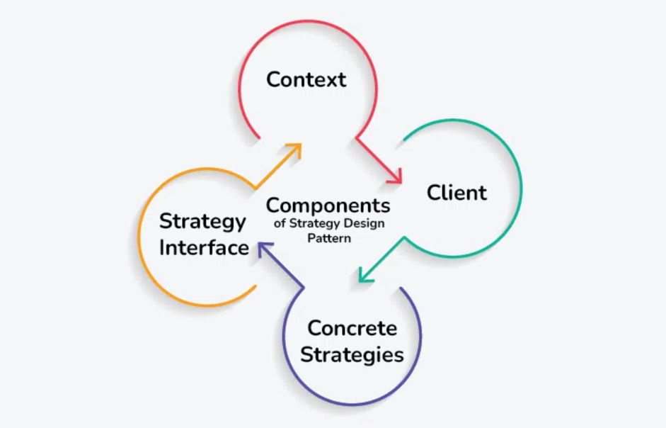

# Strategy Design Pattern : Object Behavioral 
## Also Known As
**Policy**

## What is the Strategy Design Pattern?
The **Strategy** Design Pattern 
* defines a **family of algorithms**, 
* **encapsulates** each one, 
* and makes them interchangeable, 
* allowing clients to **switch algorithms dynamically** 
* without altering the code structure(at runtime).

## When Strategy DP should be used ?
When we want to **dynamically** change the **behavior** of a class **without modifying** its **code**.

## Characteristics of Strategy design pattern :
This pattern exhibits several key characteristics, such as:

1. **Defines a family of algorithms:** The pattern allows you to encapsulate multiple algorithms or behaviors into separate classes, known as strategies.
2. **Encapsulates behaviors:** Each strategy encapsulates a specific behavior or algorithm, providing a clean and modular way to manage different variations or implementations.
3. **Enables dynamic behavior switching:** The pattern enables clients to switch between different strategies at runtime, allowing for flexible and dynamic behavior changes.
4. **Promotes object collaboration:** The pattern encourages collaboration between a context object and strategy objects, where the context delegates the execution of a behavior to a strategy object.

## Components of the Strategy Design Pattern

1. **Context :**  
A class or object known as the Context assigns the task to a strategy object and contains a reference to it.
   * It serves as an intermediary between the client and the strategy, offering an integrated approach for task execution without exposing every detail of the process.
   * The Context maintains a reference to a strategy object and calls its methods to perform the task, allowing for interchangeable strategies to be used.
2. **Strategy Interface :** 
   An abstract class or interface known as the Strategy Interface specifies a set of methods that all concrete strategies must implement.
   * As a kind of agreement, it guarantees that all strategies follow the same set of rules and are interchangeable by the Context.
   * The Strategy Interface promotes flexibility and modularity in the design by establishing a common interface that enables decoupling between the Context and the specific strategies. 
3. **Concrete Strategies :** 
   Concrete Strategies are the various implementations of the Strategy Interface. Each concrete strategy provides a specific algorithm or behavior for performing the task defined by the Strategy Interface.
   * Concrete strategies encapsulate the details of their respective algorithms and provide a method for executing the task.
   * They are interchangeable and can be selected and configured by the client based on the requirements of the task.
4. **Client :** 
The Client is responsible for selecting and configuring the appropriate strategy and providing it to the Context.
   * It knows the requirements of the task and decides which strategy to use based on those requirements.
   * The client creates an instance of the desired concrete strategy and passes it to the Context, enabling the Context to use the selected strategy to perform the task.

## Communication between the Components
In the Strategy Design Pattern, communication between the components occurs in a **structured** and **decoupled manner**.

* **Client to Context:** 
  * The Client, which knows the requirements of the task, interacts with the Context to initiate the task execution.
  * The Client selects an appropriate strategy based on the task requirements and provides it to the Context.
  * The Client may configure the selected strategy before passing it to the Context if necessary.
* **Context to Strategy:** 
  * The Context holds a reference to the selected strategy and delegates the task to it.
  * The Context invokes a method on the strategy object, triggering the execution of the specific algorithm or behavior encapsulated within the strategy.
* **Strategy to Context:** 
  * Once the strategy completes its execution, it may return a result or perform any necessary actions.
  * The strategy communicates the result or any relevant information back to the Context, which may further process or utilize the result as needed.
* **Strategy Interface as Contract:** 
  * The Strategy Interface serves as a contract that defines a set of methods that all concrete strategies must implement.
  * The Context communicates with strategies through the common interface, promoting interchangeability and decoupling.
* **Decoupled Communication:** 
  * Since the components’ communication is decoupled, the Context is not required to be aware of the exact details of how each strategy carries out the task.
  * As long as they follow the same interface, strategies can be switched or replaced without affecting the client or other strategies.
  
### Real-World Analogy of Strategy Design Pattern
**Problem Statement :** We need to sort a list of integers. However, the sorting algorithm to be used may 
vary **depending on factors** such as the **size of the list** and the desired **performance characteristics**.

### Challenges Without Using Strategy Pattern:
* **Limited Flexibility:** Implementing sorting algorithms directly within the main sorting class can make the code inflexible. Adding new sorting algorithms or changing existing ones would require modifying the main class, which violates the Open/Closed Principle.
* **Code Duplication:** Without a clear structure, you may end up duplicating sorting logic to handle different algorithms.
* **Hard-Coded Logic:** Implementing sorting logic directly within the main sorting class can make the code rigid and difficult to extend or modify.

### How Strategy Pattern helps to solve above challenges?
1. **Code Reusability:** By encapsulating sorting algorithms into separate strategy classes, you can reuse these strategies across different parts of the system. This reduces code duplication and promotes maintainability.
2. **Flexibility and Extensibility:** The Strategy Pattern makes it simple to adapt or add new sorting algorithms without changing the existing code. Since each strategy is independent, it is possible to change or expand it without impacting other system components.
3. **Separation of Concerns:** The Strategy Pattern separates sorting logic into distinct strategy classes, which encourages a clear division of responsibilities. As a result, the code is easier to test, and maintain.

### Strategy Design Pattern Example:
Below is the implementation of the above example:
1. **Context(SortingContext)**
         
        package code.dp.behavioral.strategy;
        
        public class SortingContext {
         
            private SortingStrategy sortingStrategy;
            
            public SortingContext(SortingStrategy sortingStrategy) {
                this.sortingStrategy = sortingStrategy;
            }

            public void setSortingStrategy(SortingStrategy sortingStrategy) {
                this.sortingStrategy = sortingStrategy;
            }

            public void performSort(int[] array) {
                sortingStrategy.sort(array);
            }   
        }
   2. **Strategy Interface(SortingStrategy)**

            package code.dp.behavioral.strategy;
        
            public interface SortingStrategy {
                void sort(int[] array);
            }

3. **Concrete Strategies(1,2,3)**
#### Concrete Strategies 1
    package code.dp.behavioral.strategy;
    
    public class BubbleSortStrategy implements SortingStrategy {
    
        @Override
        public void sort(int[] array) {
            // implementing BubbleSortStrategy
            System.out.println("Sorting using -- Bubble Sort Strategy !!");
        }
    }
#### Concrete Strategies 2
    package code.dp.behavioral.strategy;
    
    public class MergeSortStrategy implements SortingStrategy {
        
        @Override
        public void sort(int[] array) {
            System.out.println("Sorting using -- Merge Sort Strategy !!");
        }
    }
#### Concrete Strategies 3
    package code.dp.behavioral.strategy;
    
    public class QuickSortStrategy implements SortingStrategy {

        @Override
        public void sort(int[] array) {
            System.out.println("Sorting using -- Quick Sort Strategy !!");
        }
    }
### 4. Client Component
    package code.dp.behavioral.strategy;
    
    public class Client {
    
        public static void main(String[] args) {
            // Create SortingContext with BubbleSortStrategy
            SortingContext sortingContext = new SortingContext(new BubbleSortStrategy());
            int[] array1 = {5, 2, 9, 1, 5};
            sortingContext.performSort(array1); // Output: Sorting using Bubble Sort
    
            // Change strategy to MergeSortStrategy
            sortingContext.setSortingStrategy(new MergeSortStrategy());
            int[] array2 = {8, 3, 7, 4, 2};
            sortingContext.performSort(array2); // Output: Sorting using Merge Sort
    
            // Change strategy to QuickSortStrategy
            sortingContext.setSortingStrategy(new QuickSortStrategy());
            int[] array3 = {6, 1, 3, 9, 5};
            sortingContext.performSort(array3); // Output: Sorting using Quick Sort
        }
    }

### Output
    Sorting using -- Bubble Sort Strategy !!
    Sorting using -- Merge Sort Strategy !!
    Sorting using -- Quick Sort Strategy !!

## When to use the Strategy Design Pattern?
1. **Multiple Algorithms:** When you have multiple algorithms that can be used interchangeably based on different contexts, such as sorting algorithms (bubble sort, merge sort, quick sort), searching algorithms, compression algorithms, etc.
2. **Encapsulating Algorithms:** When you want to encapsulate the implementation details of algorithms separately from the context that uses them, allowing for easier maintenance, testing, and modification of algorithms without affecting the client code.
3. **Runtime Selection:** When you need to dynamically select and switch between different algorithms at runtime based on user preferences, configuration settings, or system states.
4. **Reducing Conditional Statements:** When you have a class with multiple conditional statements that choose between different behaviors, using the Strategy pattern helps in eliminating the need for conditional statements and making the code more modular and maintainable.
5. **Testing and Extensibility:** When you want to facilitate easier unit testing by enabling the substitution of algorithms with mock objects or stubs. Additionally, the Strategy pattern makes it easier to extend the system with new algorithms without modifying existing code.

## When not to use the Strategy Design Pattern?
1. **Single Algorithm:** If there is only one fixed algorithm that will be used throughout the lifetime of the application, and there is no need for dynamic selection or switching between algorithms, using the Strategy pattern might introduce unnecessary complexity.
2. **Overhead:** If the overhead of implementing multiple strategies outweighs the benefits, especially in simple scenarios where direct implementation without the Strategy pattern is more straightforward and clear.
3. **Inflexible Context:** If the context class tightly depends on a single algorithm and there is no need for flexibility or interchangeability, using the Strategy pattern may introduce unnecessary abstraction and complexity.

> [!NOTE]
> Useful information that users should know, even when skimming content.

> [!TIP]
> Helpful advice for doing things better or more easily.

> [!IMPORTANT]
> Key information users need to know to achieve their goal.

> [!WARNING]
> Urgent info that needs immediate user attention to avoid problems.

> [!CAUTION]
> Advises about risks or negative outcomes of certain actions.